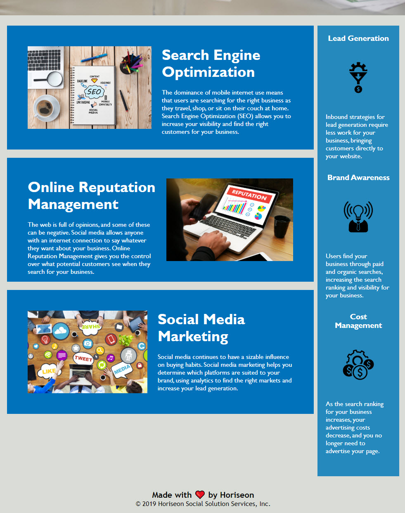

# refactoring-for-accessibility

 

Link to live site: [Refactoring for accessibility](https://clarissareeve.github.io/refactoring-for-accessibility/)

## This is a homepage for Horiseon Social Solution Services, Inc. It briefly describes the services it offers. I updated the HTML to use semantic elements, added alt descriptions to better follow accessibility standards, and updated the CSS to make it more efficient.